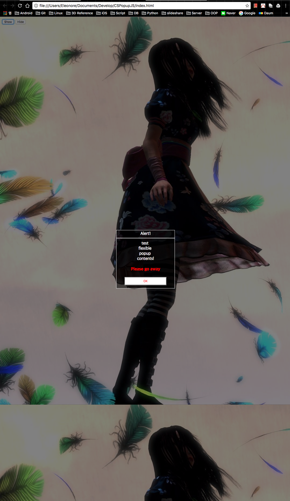

# CSPopupJS 
Custom popup view with JS 



#Requirements
	Test on Chrome v55.x

#Usage

	You can figure out how to use from example in "index.html".
	To use CSPopup to your project, refer to below example.
	```javascript	
	var popup;
	var callback = function() {
		hide();
	};
    function show() {
		popup.show();
	}
    function hide() {
		popup.hide();
	}

    var btnArr = [CSPopup.makeButton("OK",CSPopup.LEFT,callback),CSPopup.makeButton("CANCEL",CSPopup.RIGHT,callback)];
	popup = CSPopup.makePopup("Alert1", "test <br> flexible <br> popup <br> contents! ", btnArr, "Please go away");
	```
#License
	The content of this project itself is licensed under the GPL v2, but sample emoticon images are not allowed to use public. It's owned by Korea Internet Center inc. 
